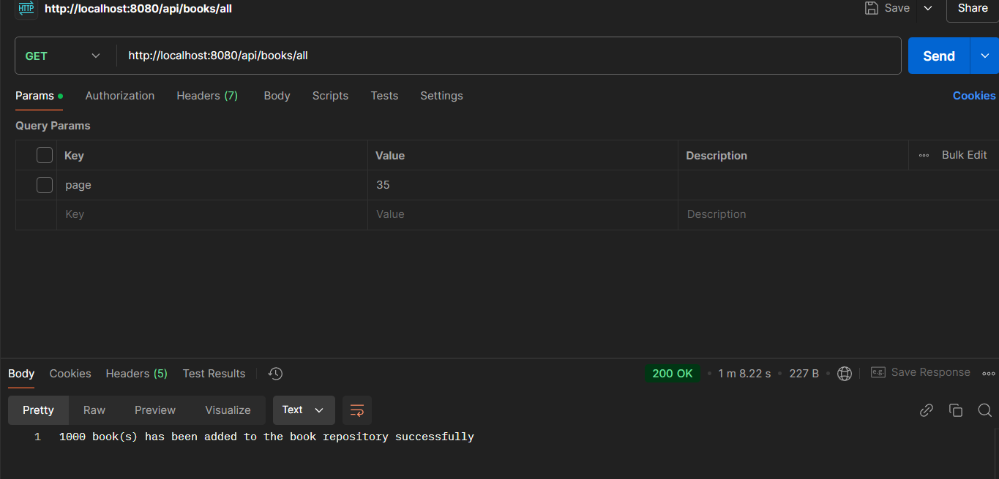
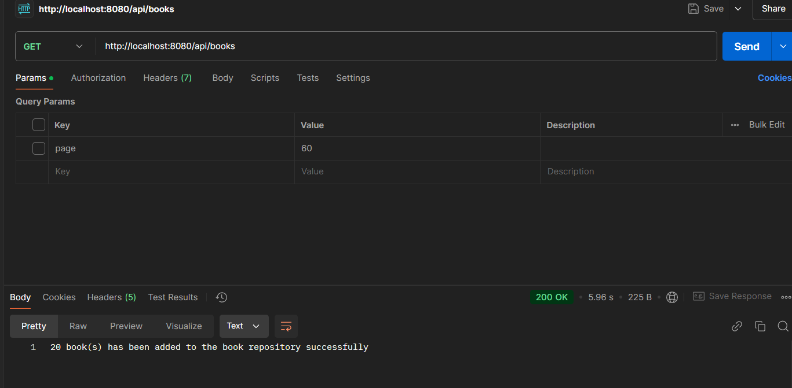
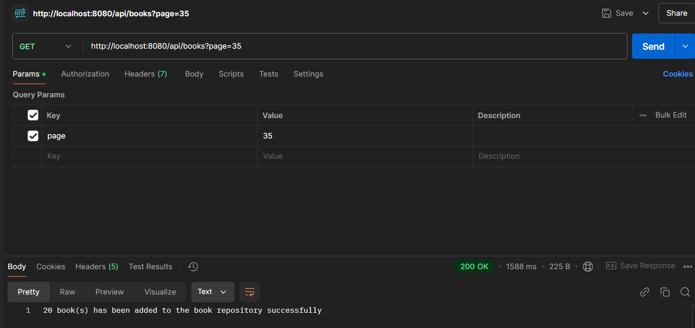

Before the start you need to set up environment variables `DB_USER` and `DB_PASSWORD` which correspond for database username and password

To run application you need navigate to the root of the project via command line and execute the command

`mvn spring-boot:run`

There are 2 endpoints: 

    1) api/books/all responsible for adding all books from all pages to database. 
    Example link: http://localhost:8080/api/books/all. 
    Successfull responce: "1000 book(s) has been added to the book repository successfully"

    2) api/books or api/books?page=4. If there is no parametr(api/books) default value 1.
    Example link: http://localhost:8080/api/books or http://localhost:8080/api/books?page=4.
    Successfull responce: "20 book(s) has been added to the book repository successfully"

